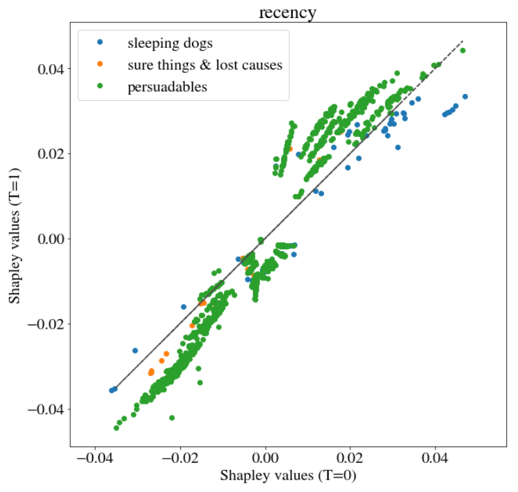
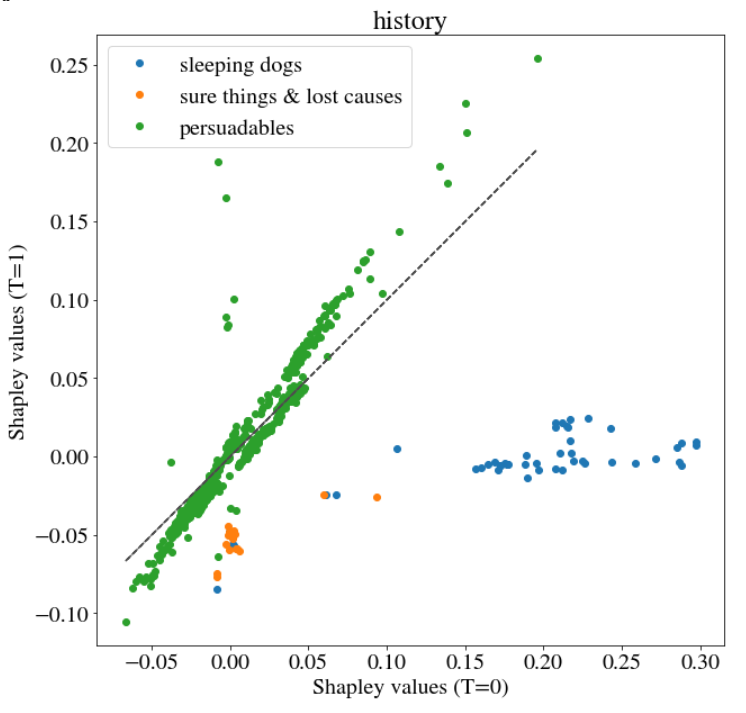

# Story Uplift modeling on marketing dataset: eXplainable predictions for optimized marketing campaigns {#story-uplift-marketing1}

*Authors: Jan Ludziejewski (Warsaw University), Paulina Tomaszewska (Warsaw University of Technology), Andżelika Zalewska (Warsaw University of Technology)*

*Mentors: Łukasz Frydrych (McKinsey), Łukasz Pająk (McKinsey)*

**Key points**:

* uplift models thanks to its additivity give wide range of possiblities while using XAI  
* Shapley values can be used to explain model in different aspects - they can be used to estimate Variable importance and Partial Dependence Plots  
* [tutaj trzeba dopisać to co stricte dowiedzieliśmy się z uplift]  

## Introduction 

Running a business is a challenge. It involves making a lot of decisions to maximize profits and cut down costs - finding the tradeoff is not a straightforward task.
Here come Machine Learning and uplift models that can help in optimizing marketing costs.

It is widely believed that it is good idea to send marketing offer to all company's customers. In fact it is not always a case – the matter has been described later. While large scale campaigns are costly it is important to consider Return on Investment (ROI) in decision-making.

Goal of this paper is to scientifically answer the question: *"Is it true that by sending the marketing offer we only extend the chance for the customer to buy our product and therefore extend our profit?"*.

The issue was already investigated [@book_uplift] and it was pointed out that customers of any company can be divided into 4 groups (Figure: \@ref(fig:4groups)). 

```{r 4groups, echo=FALSE, fig.cap='Customer types taking into consideration their response to treatment [@4groups_chart]', out.width = '50%', fig.align='center'}
knitr::include_graphics("images/09_e45e2d97-confmatrix_alt.png")
```

The image matrix was created based on customer decision to buy a product depending on the fact that they were addressed by a marketing campaign or not. The action used for triggering in customers the particular behavior is called treatment. In the 4 groups we distinguish (Figure: \@ref(fig:4groups)):

* <span style="color:darkgreen">***"persuadables"***</span>: the customers that without being exposed to marketing campaign would **NOT** buy a product 
* <span style="color:grey">***"sure things"***</span>: the customers that irrespective of the fact that they experienced treatment or not are going to buy a product
* <span style="color:grey">***"lost causes"***</span>: the customers that irrespective of the fact that they experienced treatment or not are **NOT** going to buy a product 
* <span style="color:darkred"> ***"sleeping dogs"***</span>: the customers that without being exposed to marketing campaign would buy a product but in case they receive a marketing offer they resign 

It can be then observed that in case of *"lost causes"* and *"sure things"* sending a marketing offer makes no impact therefore it doesn't make sense to spend money on targeting these customers. As the company we should however pay more attention to the groups *"persuadables"* and *"sleeping dogs"*. In the case of the first group, bearing the costs of the marketing campaign will bring benefits. In the case of the latter, we not only spend money on targeting them but as a result, we will also discourage them from buying the product therefore we as a company lose twice. The case of *"sleeping dogs"* can seem irrealistic, therefore we present an example. 

> *Let's imagine there is a customer that subscribed to our paid newsletter. He forgot that he pays each month fixed fee. He would continue paying unless a company sends him a discount offer. At this moment the customer realizes that he doesn't need the product and unsubscribes.*

By understanding the structure of the company's customers, it can target its offer more effectively.


### Approaches towards uplift modeling

In [@uplift_stanford] it was pointed out that the problem of deciding whether it is profitable to send an offer to a particular customer can be tackled from two different perspectives:  

* predictive response modeling (it is classical classification task where model assigns a probability to each of the classes)  
* uplift modeling (where the "incremental" probability of purchase is modeled)  

The latter is tailored to this particular task and is more challenging.
**Uplift modeling is a technique that helps to determine probability gain that the customer by getting the marketing materials will buy a product.**
The field is relatively new. The two most common approaches are [@uplift_approaches]:  

* **Two Model**  
In this method two classifiers are build. The one is trained on observations that received treatment *(model_T1)* and the second is trained on observations that didn't receive treatment *(model_T0)*. Later the uplift for particular observations is calculated. If the observation experienced treatment then it is an input to the *model_T1* and the probability that the customer will buy a product is calculated. Next it is investigated what would happen if the customer didn't receive treatment. In that case the treatment indicator in observation's feature is changed to "zero". Such a modified record is an input to *model_T0* that predicts the probability that such a customer will buy a product. The uplift is calculated as the difference between the output of the *model_T1* and *model_T0*. The higher the difference, the more profitable is addressing marketing campaign to a particular customer. Analogically, uplift is computed for the people that didn't experienced treatment. 

* **One Model**  
This approach is similar conceptually to the Two model approach with such a difference that instead of building two classifiers only one is used. Therefore every observation is an input to the model that generates prediction. Later the indicator in the treatment column is changed into the negation and such a vector is used as input to the model that once again output probability that the customer buys a product. The uplift is the difference between the two predicted probabilities. 

```{r approches, echo=FALSE, fig.cap='Two Model vs One Model approach (own elaboration)', out.width = '100%', fig.align='center'}
knitr::include_graphics("images/09_one_two_model.png")
```

As uplift modeling is an emerging field there isn't a clear evidence what method is better to use. 
In [@uplift_svm], the authors investigated the application of SVM (*support vector machine*). But since SVM requires precise, long-lasting finetuning we decided to use XGBoost (the architecture of our solution is described in detail in section Model).

## Dataset

There is a scarcity of well-documented datasets dedicated to uplift modeling. Therefore the authors of [@uplift_dataset_modification] proposed to artificially modify available datasets to extract information about treatment. As the purpose of this story is to investigate XAI techniques in the domain of uplift modeling we decided to use real-life dataset. 
We chose Kevin Hillstrom's dataset from E-Mail Analytics And Data Mining Challenge [@uplift_dataset_marketing]. The dataset consists of 64000 records reflecting customers that last purchased within 12 months. As a treatment an e-mail campaign was addressed:

* 1/3 of customers were randomly chosen to receive an e-mail campaign featuring Men's merchandise
* 1/3 were randomly chosen to receive an e-mail campaign featuring Women's merchandise
* 1/3 were randomly chosen to not receive an e-mail campaign *("control group")*  

As an expected behavior the following actions were determined: 

* visit the company's website within 2 weeks after sending to the customers a marketing campaign 
* purchase a product from the website within 2 weeks after sending to the customers a marketing campaign 

In the challenge the task was to determine whether the Men's or Women's e-mail campaign was successful. In our task we reformulated the task and we wanted to answer the question of whether any e-mail campaign was profitable for the company.

The features about customers in the dataset are specified in Figure \@ref(fig:dataset):

```{r dataset, echo=FALSE, fig.cap='Customer features in the dataset (own elaboration)', out.width = '100%', fig.align='center'}
knitr::include_graphics("images/09_xai_customer.jpg")
```

There is also information about customer activity in the two weeks following delivery of the e-mail campaign (these can be interpreted as labels):

* Visit: 1/0 indicator, 1 = Customer visited website in the following two weeks.
* Conversion: 1/0 indicator, 1 = Customer purchased merchandise in the following two weeks.
* Spent: Actual dollars spent in the following two weeks.


### Feature engineering

The dataset is largely imbalanced - there are only about 15% of positive cases in column *Visit* and 9% in column *Conversion*.
In such a situation we decided to use column *Visit* as a target for the classifier.
As the number of columns is small we decided to use one-hot encoding for transforming categorical variables instead of target encoding. 

## Model
There are not many packages dedicated to uplift modeling in python. We investigated the two: pylift [@pylift] and pyuplift [@pyuplift]. The latter enables usage of 4 types of models - one of those is the Two Model approach. In the pylift package there is the TransformedOutcome class that generates predictions. However, the model itself is not well described and uses XGBRegressor underneath that is not intuitive. Fortunately the package offer also the class UpliftEval that allows uplift metrics visualization. 
In the scene, we decided to create own classifier (as in the One Model approach) and use UpliftEval class from the pylift model for metric evaluation.
As the classifier we used fine-tuned XGBoost with the score function as the area under the cumulative gain chart (described below). In the figure \@ref(fig:upliftRES) we show the cumulative gain chart for train and test sets. 


```{r upliftRES, echo=FALSE, fig.cap='Cumulative gain chart: (left) train set, (right) test set', out.width = '50%', fig.align='default', fig.show="hold"}


```
In order to evaluate performance of uplift models The Qini curve is not suggested as it is vulnerable to overfitting to the treatment label. Therefore the Cumulative gain chart is used. It is the most unbiased estimate of the uplift. In the package Pylift it is implemented based on the formula:
$Cumulative\ gain(\phi) = (\frac {n_{t,1}(\phi)}{n_{t,1}}-\frac {n_{c,1}(\phi)}{n_{c,1}})(\frac{n_t(\phi)+n_c(\phi)}{N_t+N_c})$   
where  
$n_{t,1} (\phi)$ is the number of observations in the treatment group at cutoff level $\phi$ with label 1  
$n_{c,1} (\phi)$ is the number of observations in the control group at cutoff level $\phi$ with label 1  
$n_{t,1}$ is the total number of observations in the treatment group with label 1 (analogically $n_{c,1}$)  
$N_t$ is the total number of observations in treatment group (analogically $N_c$)  

The plot can be interpreted as follows:  
First the customers are sorted in descending order based on predicted uplift. Later some friction of data is taken for the analysis (e.g. 10% of the people with the highest score). This cutoff is represented as $\phi$ in the formula. Next the uplift gain is verified for the subset. At the beginning of the curve the gain is the biggest as it refers to the *"persuadables"* group. Later the curve stabilizes as it depicts the groups: *"lost causes"* and *"sure things"*. In the end the curve decrease as there are *"sleeping dogs"* with negative uplift.

It can be seen that our model is better than random choice but much worse than the practical/theoretical maximum possible. It is also worse than the case without *"sleeping dogs"*.
It is worth noticing that our model didn't experience overfitting as its quality on the train and test sets is similar.


## Explanations
The Cumulative Gain chart shows that the proposed model brings additional value. Here comes the question of whether the model is reliable? Does it make the decision based on the features that are important from an expert knowledge perspective? Such judgment can be done based on the results of XAI tools.
We decided to investigate model interpretability from instance-level and dataset-level perspective.

### Instance-level

In order to explain model output for particular customer we employed Shapley values [@feature_importance_shap]. 

Before we move to the investigation of Shapley values let's get to know customers that got the highest and the lowest uplift. In this section we will analyze the reliability of predictions for these particular instances. In the table \@ref(tab:personalTABLE) there is all the information provided to the system about the customers.

```{r personalTABLE, echo=FALSE}
tab=read.csv2("images/09_personal.info.csv", sep=',')
knitr::kable(tab, caption='Customer with the highest and the lowest uplift - features' )
```

As can be seen the customers spend almost the same amount of money during the last 12 months on our company's products.
The person with the highest uplift did last shopping 2 months ago whereas the person with the lowest uplift did it 5 months ago. In the dataset some people purchased the product for the last time even 12 months ago so the person is not the most severe case in that sense. Apart from many other differences among the two customers the key is that the person with the highest uplift received treatment whereas the second customer didn't.
[wstawić histogram recency i history!!!]

Below we present Shapley values for the customer desribed in \@ref(tab:personalTABLE). The values were computed directly on uplift model \@ref(fig:upliftSHAP).
```{r upliftSHAP, echo=FALSE, fig.cap='Shapley values: (left) customer with the lowest uplift, (right) customer with the highest uplift', out.width = '50%', fig.align='default', fig.show="hold"}


```

Conclusions:   
In can be seen that in both cases big contribution to the final result has information about customer history (about 230 USD) and the fact that the customer bought products from Womens collection. What is interestin is the fact that the customers have almost the same values of these two attribute but opposite sign of its contribution. 

We can benefit from additive feature attribution property of Shapley values to model the uplift:

$uplift=P(purchase|\ treatment=1) - P(purchase|\ treatment=0))$ 
$SHAP(uplift)= SHAP(P(purchase|\ treatment=1)) - SHAP(P(purchase|\ treatment=0))$ 

This property gives us a great opportunity to evaluate these two vectors of Shapley values independently. For example if we use any tree-based model, we can make use of tree-based kernel for Shapley value estimation (faster and better convergent) instead of modeling it directly as a black-box (uplift) model.

Experimental results proved, that these two ways of calculation are providing close estimations, with precision to numerical errors.

In a table \@ref(tab:upliftTABLE) there is a comparison of Shapley values obtained using two methods for the customer with the lowest uplift.

```{r upliftTABLE, echo=FALSE}
tab=read.csv2("images/09_shap_diff.csv", sep=',')
options(digits=4)
knitr::kable(tab, caption = 'Shapley values obtained using two methods')
```

Experimental results proved, that these two ways of calculation are providing close estimations, with precision to numerical errors There are few feature that depending on method have small positive or negative Shapley value. This is caused by the fact that for the estimation of Shapley values directly using uplift model the KernelExplainer was used. It has data parameter however in case of big dataset it is recommended in the documentation to take subset od records. In our case we took random subset therefore this could impact the results. Nevertheless, we proved that in case of our example the two methods lead to similar values.


The specificity of uplift models in terms of the possibility to analyse them through additivity of Shapley values gives room for another valuable inspection. 
Below we present how Shapley values differ depending on the fact that the customer was or wasn't addressed by treatment. On *x* axis there are Shapley values in case T=0 and on y axis in case T=1.In each chart there is Shapley value referring to one variable. In situation when the Shapley values are the same irrespective of the presence or absence of treatment they would lie on identity line. Moreover, there is color used as third dimension indicating the group that the particular customer belongs to. The division is made based on predicted uplift. As almost all customers were categorized to *"persuadables"*, we decided to show on the plot only 1000 records from this group to maintain chart readability.

```{r recencySHAP, echo=FALSE, fig.cap='Shapley values on variable recency in case T=0 and T=1', out.width = '50%', fig.align='center'}

```

It can be seen that *"persuadables"* are slightly above and below identity line as we have set 	\( \epsilon \) value as +-0.01.
```{r historySHAP, echo=FALSE, fig.cap='Shapley values on variable history in case T=0 and T=1', out.width = '50%', fig.align='center'}

```
In Figure \@ref(fig:historySHAP) it can be seen that three customer groups are distinctive groups that could have been obtained trough clustering methods.

Apart from continuous variable we also investigated binary variable. Most of them looked similar as Figure \@ref(fig:historySHAP) but there was one exception - variable *womens*. 
```{r womensSHAP, echo=FALSE, fig.cap='Shapley values on variable womens in case T=0 and T=1', out.width = '50%', fig.align='center'}

```
It can be seen that the customer groups are overlapping. They constitue very homogenous groups.


Conclusions:  
In the case of our model there is no need to apply LIME as its main advantages - sparsity - is not important as we have few columns.


### Dataset- (subset-) level
Unfortunately, it's impossible to calculate directly Permutation Feature Importance, because of the previously mentioned problem with lack of full information in both cases: Will the client purchase after treatment, and will be without it. Because of having in disposal only historical data (not an oracle), we have only one of these two pieces of information. However, we can make use of the previously computed Shapley values of uplift to calculate the same value of permutational feature importance as an average of local Shapley importance (defined in a permutational way itself, however, calculated more smartly, more in [@feature_importance_shap].

We decided to evaluate feature importance not from the well-known dataset-level but subset-level. We extracted from the dataset 3 groups: *"sleeping dogs"*, *"persuadables"* and "no impact" (this group is a merge of the groups: *"sure things"* and *"lost causes"*). The division was based on the predicted uplift. *"Sleeping dogs"* have negative uplift, "no impact" have uplift from zero to the defined epsilon and *"persuadables"* have uplift greater than epsilon. We decided to not take into consideration epsilon in the case of *"sleeping dogs"* as we want to be more conservative. The worst thing the company can do is to discourage the customer from buying.


```{r sleepingDOGS, echo=FALSE, fig.cap='Variable importance - "sleeping dogs"', out.width = '60%', fig.align='center'}

```


```{r noIMPACT, echo=FALSE, fig.cap='Variable importance - "no impact"', out.width = '60%', fig.align='center'}
knitr::include_graphics("images/09_sure_things_lost_cases_feature_importance.PNG")
```


```{r persuadables, echo=FALSE, fig.cap='Variable importance - "persuadables"', out.width = '60%', fig.align='center'}
knitr::include_graphics("images/09_persuadables_feature_importance.PNG")
```


 
You may ask how to show a dependence plot. You have two options. The most common method is the Partial Dependence Plot and the different one is the SHAP dependence plot. The Partial Dependence Plot shows the marginal effect one or two features have on the predicted outcome of a machine learning model [@pdp]. It tells whether the relationship between the target and a feature is linear, monotonic or more complex. In order to create a dependence plot, you can also use The SHAP dependence plot, which shows how a feature’s value (x-axis) impacted the prediction (y-axis) of every sample (each dot) in a dataset [@shap_dependence_plot]. This provides richer information than traditional Partial Dependence Plot, so you may see that the SHAP value is a great tool among others, because we have at least two additional information: density, variety of observations.???????

We generated the Partial Dependence Plot for all features and the SHAP dependence plot based on 1k observations only for *history* and *recency* features. 

```{r pdp_history, echo=FALSE, fig.cap='(left) Partial Dependence Plot / Accumulated Local Effects plot, (right) The SHAP Dependence Plot based on 1k observations', out.width = '50%', fig.align='default',fig.show="hold"}
knitr::include_graphics("images/history_PDP_ALE.PNG")
knitr::include_graphics("images/history_shap_dependence_plot.PNG")
```

For our model The SHAP Dependence Plot reflects the shape of the Partial Dependence Plot, while also highlighting the impact of *history* on uplift prediction is extremely different for people with the same value of *history*. Many individuals have a recorded *history* of 250 dollars in our dataset, but the impact of that measurement on their uplift varies.

```{r pdp_recency, echo=FALSE, fig.cap='(left) Partial Dependence Plot / Accumulated Local Effects plot, (right) The SHAP Dependence Plot based on 1k observations', out.width = '50%', fig.align='default',fig.show="hold"}
knitr::include_graphics("images/recency_PDP_ALE.PNG")
knitr::include_graphics("images/recency_shap_dependence_plot.PNG")
```

```{r pdp_mens_womens, echo=FALSE, fig.cap='Partial Dependence Plot / Accumulated Local Effects plot', out.width = '100%', fig.align='center'}
knitr::include_graphics("images/mens_womens_PDP_ALE.PNG")
```

```{r pdp_zip, echo=FALSE, fig.cap='Partial Dependence Plot / Accumulated Local Effects plot', out.width = '100%', fig.align='center'}
knitr::include_graphics("images/zip_PDP_ALE.PNG")
```

```{r pdp_newbie, echo=FALSE, fig.cap='Partial Dependence Plot / Accumulated Local Effects plot', out.width = '50%', fig.align='center'}
knitr::include_graphics("images/newbie_PDP_ALE.PNG")
```

```{r pdp_channel, echo=FALSE, fig.cap='Partial Dependence Plot / Accumulated Local Effects plot', out.width = '100%', fig.align='center'}
knitr::include_graphics("images/channel_PDP_ALE.PNG")
```

## Summary and conclusions 
Using XAI for uplift modeling helps to understand its complex models better. The analysis goes beyond just assessing whether the model is reliable... it can help the executive to understand better the company customers - their behavior without paying for some extra surveys to investigate their attitude towards the company.

A vital part of our work was adjusting XAI techniques for the particularities of uplift modeling. We found out that thanks to its additivity Shapley values are well suited for uplift modeling - we showed two methods of using it. We identified limitations of well-known Permutation Feature Importance in terms of explaining uplift modeling. It is caused by the fact that unlike in other supervised models here we do not have exactly labels. Therefore we used the generalization of Shapley values that converge to Permutation Feature Importance. We employed the analysis for the three groups of customers based on the corresponding uplift.

.........................................

Here add the most important conclusions related to the XAI analysis.
What did you learn? 
Where were the biggest difficulties?
What else did you recommend?


zdaje misie tez ze patrzac na sama kubelkowosc danych (tzn pomijajac hisotry ktore teraz sie wybilo bo mamy przetrenowany model zeby miec sleeping dogi xD) to po prostu musi tam byc wiele przypadkow o ktorych wiemy dokladnie to samo i maja rozne odpowiedzi


