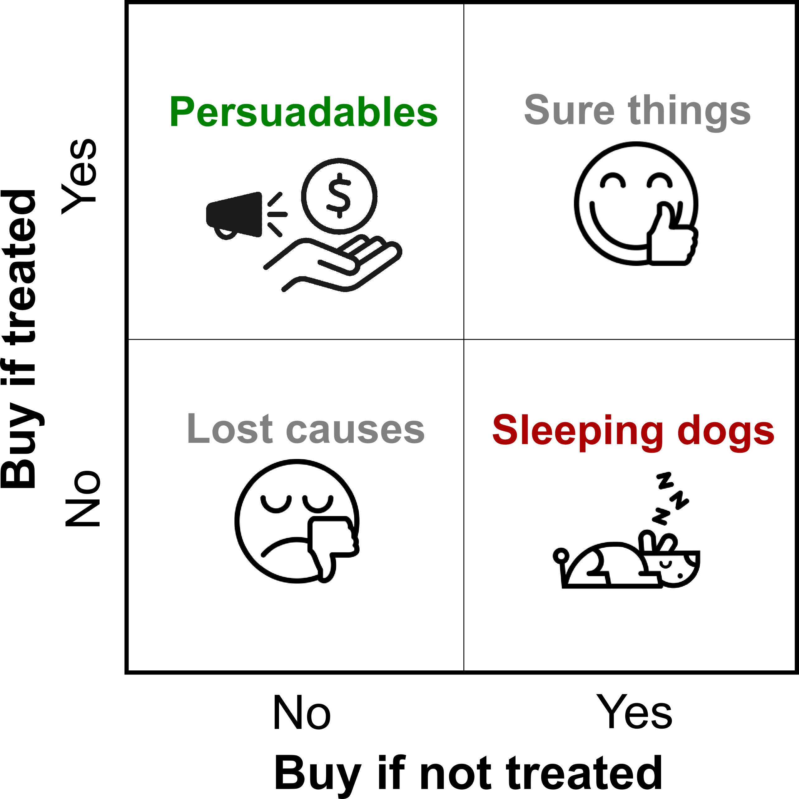

# Story Uplift modeling on marketing dataset: eXplainable predictions for optimized marketing campaigns {#story-uplift-marketing}

*Authors: Jan Ludziejewski (Warsaw University), Paulina Tomaszewska(Warsaw University of Technology), Andżelika Zalewska (Warsaw University of Technology)*

*Mentors: Łukasz Frydrych (McKinsey), Łukasz Pająk (McKinsey)*

## Introduction 

Running bussiness is a challenge. It involves making a lot of decisions in order to maximize profits and cut down costs, finding the tradeoff is not an straight-forward task.
Here comes Machine Learning and uplift models that can help in optimizing marketing costs.

People often ask whether it makes sense to address marketing campaigns to all company's customers. 
From one point of view by sending an offer we think the probability that the customer will buy your product is higher - in fact it is not always the cases 
(the matter will be described in details later).
On the other hand, making large-scale campaign is costly. It would be good to know what is the return of investment. 

Above we presented the common sense arguments but how science says to the question: "Is it true that by sending the marketing offer we only extend the chance for the customer to buy our product and therefore extend out profit?".
<!--  -->
The issue was already investigated [cite] and it was pointed out that customers of any company can be divided into 4 groups [refer to image]. The image matrix was created based on the customer decision to buy a product depending on the fact that they were addressed by marketing campaign or not. The action used for trigggering in customer the particular behaviour is called treatment. In the 4 groups we distinghuish:
- the customers that irrespective of the fact that they experienced treatment or now that are going to buy a product (in the graphics this group is called "sure things")
- the customers that irrespective of the fact that they experienced treatment or now that are NOT going to buy a product (in the graphics this group is called "lost causes")
- the customers that without being exposed to marketing campaing would NOT buy a product (these are called "persuadables")
- the customers that without being exposed to marketing campaing would buy a product but in case thay receive a marketing offer they resign (these are called "sleeping dogs")

It can be than observed that in case of "lost causes" and "sure things" sending a marketing offer makes no impact therefore it doesn't make sense to spend money on targeting these customers. As the company we should however pay more attention to the groups "persuadables" and "sleeping dogs". In case of the first bearing the costs of marketing campaign will bring benefit. In case of the latter we not only spend money on targeting them but as the result we will also discourage them from buying the product therefore we as a company loose two times. The case of sleeping dogs can seem irrealistic, therefore we present an example. Let's imagine there is a customer that subscriped our paid newsletter. He forgot that he pays each month fixed fee. He would continue paying unless a company sends him a discount offer. At this moment the customer realises that he doesn;t need and offer and unsubscripes.

```{r cc-logo, echo=FALSE, fig.cap='Customer types taking into consideration their response to treatment', out.width = '50%', fig.align='center'}

```

By understading the structure of the company's customers, it can target its offer more effectively.

### Approaches towards uplift modeling
Uplift modeling is a technique that helps to determine probability gain that the customer by getting the marketing materials will buy a product.
The field is relatievely new. The two most commmon approaches are:
- Two Model
In this method there are build two classifiers. The one is trained on observations that received treatment (model_A) and the second is trained on observations that didn't receive a treatment (model_B). Later the uplift for particular observations is calculated. If the observation experience treatment  
- One Model
[tutaj streszczę artykuł który czytaliśmy na medium]

## Dataset
[tutaj opiszę nasz dataset + wizualizacje] 


## Model 

Place a description of the model(s) here. Focus on key information on the design and quality of the model(s) developed.

## Explanations

Here, show how XAI techniques can be used to solve the problem.
Will dataset specific or instance specific techniques help more?

Will XAI be useful before (pre), during (in) or after (post) modeling?

What is interesting to learn from the XAI analysis?


## Summary and conclusions 

Here add the most important conclusions related to the XAI analysis.
What did you learn? 
Where were the biggest difficulties?
What else did you recommend?
